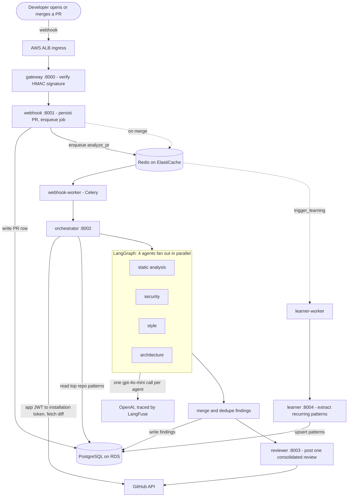

# AI Code Reviewer

A GitHub App that reviews pull requests with four parallel LLM agents, deployed as seven microservices on Kubernetes (EKS).

<p align="center">
  
  
  
  
  
  
  
  
  
  
  
  
  
  
  
</p>

When a PR is opened, the system fetches the diff, runs four single-purpose agents over it (static analysis, security, style, architecture), and posts a single consolidated review back on the PR - usually within a minute. When a PR is merged, a learner extracts the recurring issues into a per-repository memory that conditions future reviews.

This is a portfolio project. It was built to show end-to-end ownership of an LLM feature: the multi-agent design, the surrounding backend, and the cloud/MLOps work to ship it. It was deployed to AWS, validated end-to-end on a real PR, then torn down with `terraform destroy` so ongoing cost is $0. There is no permanently-live demo by design; the proof is below.

---

## What it does

Code review is a bottleneck, and the boring-but-important issues - a hardcoded secret, an `eval()` on user input, a missing error path - are exactly the ones a tired reviewer skims past. This bot does a first pass automatically the moment a PR opens, so a human reviewer starts from a triaged list instead of a blank diff.

The interesting part is not "call an LLM on a diff." It is everything around that: splitting the job across specialized agents that run concurrently, giving each one a focused prompt, persisting findings, feeding merged patterns back into later reviews, and running the whole thing as independently-deployable services with tracing, metrics, autoscaling, and a CI/CD pipeline per service.


> The full printout of that run is in [`ai-code-review-pr-screenshot.pdf`](ai-code-review-pr-screenshot.pdf).

## Architecture



## What this demonstrates

Mapped honestly to an AI/ML engineer role:

| Area | Where it shows up here |
|---|---|
| Multi-agent LLM orchestration | A LangGraph graph whose conditional entry point fans the diff out to four role-specific agents in parallel (`Send`), each calling `gpt-4o-mini` and returning structured JSON, followed by a merge/dedupe node. Prompts are per-agent; the style agent is conditioned on patterns learned from earlier PRs. |
| LLM observability and evaluation | Every model call is traced in LangFuse (prompt, response, tokens, cost, latency). A scheduled GitHub Action runs a RAGAS job - faithfulness and answer-relevancy - over recent findings and fails the run below a 0.7 faithfulness threshold. |
| MLOps and deployment | Seven services containerized and run on AWS EKS, with all infrastructure (VPC, EKS, RDS Postgres, ElastiCache Redis, six ECR repos, S3) defined in Terraform. A Horizontal Pod Autoscaler scales the orchestrator on CPU. |
| CI/CD | Five independent per-service pipelines, path-filtered, sharing one reusable workflow: test → build and push to ECR → `kubectl` deploy. GitHub authenticates to AWS over OIDC, so there are no long-lived AWS keys in the repo. |
| Backend and distributed systems | Async FastAPI services, Celery/Redis queues decoupling webhook receipt from analysis, a Postgres schema with Alembic migrations, idempotent PR handling, and GitHub App auth (signed JWT exchanged for an installation token). |
| Monitoring | Prometheus scrapes a `/metrics` endpoint on every service; a Grafana dashboard tracks per-service request rate, p99 latency, and 5xx error rate, plus an overall-health row. |

## How it works

**Receiving the event.** GitHub sends PR webhooks to an ALB, which routes to the `gateway`. The gateway does one job: recompute the HMAC-SHA256 signature over the raw body and compare it (constant-time) against `X-Hub-Signature-256`. Only verified requests are forwarded to the `webhook` service. Keeping signature verification in its own edge service separates "is this really from GitHub" from any business logic.

**Persisting and queueing.** The `webhook` service writes a `pull_requests` row and enqueues an `analyze_pr` task on Redis, then returns `202` immediately - the analysis never blocks the webhook response. It deduplicates on `(repo, pr_number, head_sha)`, so a redelivered or duplicate event doesn't trigger a second review. A Celery worker picks the task up and calls the orchestrator.

**Analyzing the diff.** The `orchestrator` mints a GitHub App installation token (RS256 JWT signed with the app private key, exchanged for a short-lived token), fetches the PR as a unified diff, and loads the top patterns previously learned for that repository. It then invokes the LangGraph graph: the entry point fans out to the four agents concurrently, each sends its system prompt plus the diff to `gpt-4o-mini`, and the responses are parsed from JSON (with a fenced-code-block fallback) into findings tagged with file, line, severity, and the agent that produced them. Findings are written to Postgres and handed to the reviewer.

**Posting the review.** The `reviewer` builds a markdown summary and a set of inline comments, then posts a single GitHub review. If GitHub rejects the inline anchors with a 422 - LLM-supplied line numbers are not always valid against the diff - it retries with the summary body alone. One review per PR rather than a swarm of separate comments, with a deliberate fallback when precise line placement fails.

**Learning on merge.** When a PR is merged, the webhook enqueues a `trigger_learning` task. The `learner` selects that PR's `warning`/`error` findings and upserts them into a `patterns` table keyed by `(repo, message)` with a frequency counter (`ON CONFLICT ... DO UPDATE`). On the next PR for that repo, the style agent receives the highest-frequency patterns in its prompt - a lightweight feedback loop rather than any model fine-tuning.

**Observability and evaluation.** Because the orchestrator uses LangFuse's OpenAI drop-in client, every agent call is traced with its prompt, token usage, cost, and latency. Each service also exposes Prometheus metrics that feed the Grafana dashboard. Separately, a weekly GitHub Action builds an evaluation image and runs it as a Kubernetes Job: it pulls recent findings from Postgres, scores them with RAGAS faithfulness and answer-relevancy, and fails if mean faithfulness drops below 0.7.

## Key decisions and tradeoffs

**Four specialized agents instead of one prompt.** Multi-agent systems are where the industry is heading, and I wanted to build one properly rather than stuff every concern into a single prompt. Splitting review into static-analysis, security, style, and architecture agents means each gets a focused instruction set, the four calls run in parallel, and a new dimension is one more node rather than a prompt rewrite. The cost is four model calls per review instead of one, and a merge step to reconcile them.

**`gpt-4o-mini` everywhere.** A deliberate cost choice. A full review of the test PR cost about $0.0007. I did not benchmark a larger model - I'm running this on a personal budget - so I can't claim a quality comparison, only that the small model produced accurate findings on the cases I tested.

**Seven services and full cloud infrastructure.** The service split, EKS, autoscaling, and Terraform are here primarily to demonstrate production and MLOps depth, not because this traffic needs a cluster. That said, the boundaries are real: the gateway isolates signature verification, the queue decouples webhook receipt from slow analysis, and per-service pipelines mean a fix in the orchestrator redeploys only the orchestrator.

**OIDC, not stored AWS keys.** GitHub Actions assumes an IAM role over OIDC. There are no long-lived AWS credentials in the repository or in GitHub secrets - only the role ARN and account ID.

**Cost-minimized infrastructure.** No NAT gateway (workloads sit in public subnets behind security groups), `db.t3.micro` Postgres, `cache.t3.micro` Redis, two `t3.medium` nodes. This keeps the bill small for a demo; the tradeoff - public subnets instead of private subnets with a NAT - is noted under limitations.

**Most of the learning curve was the cloud, not the model.** The genuinely new ground for me was the deployment stack: Docker images, an EKS cluster and its node groups, IAM roles and OIDC, ECR, the AWS Load Balancer Controller and ALB/NLB ingress, and the Prometheus/Grafana monitoring setup. Wiring those together correctly - and tearing them all back down to $0 - was the bulk of the work.

## Results

This was validated end-to-end, not just unit-tested in isolation:

- **A real PR got reviewed.** On a sandbox repository, opening a PR containing a deliberately flawed file triggered a review within about a minute. The agents flagged genuine problems - a hardcoded credential (`password = "admin123"`) and an `eval()` over concatenated input among them - posted as one consolidated review. (See the screenshot above and the linked PDF.)
- **Cost is a fraction of a cent.** LangFuse recorded the four-agent run at roughly **$0.0007 total** on `gpt-4o-mini`, with a median model-call latency around **5 seconds**; since the agents run concurrently, a review finishes in about the time of the slowest agent.
- **The infrastructure really ran.** The full stack was provisioned on EKS in `ap-southeast-2`, exercised, then destroyed - `terraform destroy` removed 66 resources, taking ongoing cost to $0.


## Tech stack

- **Language / runtime:** Python 3.11, FastAPI, Uvicorn, async I/O throughout (`httpx`, `asyncpg`)
- **AI:** LangGraph for agent orchestration, OpenAI `gpt-4o-mini`, LangFuse for tracing, RAGAS for offline evaluation
- **Data / messaging:** PostgreSQL 15 with SQLAlchemy (async) and Alembic migrations, Redis + Celery for task queues
- **Infrastructure:** Docker, Kubernetes on AWS EKS, Terraform (VPC, EKS, RDS, ElastiCache, ECR, S3, IAM), AWS Load Balancer Controller for ALB ingress
- **CI/CD:** GitHub Actions with OIDC-based AWS auth; reusable per-service workflow
- **Monitoring:** Prometheus + Grafana
- **Auth:** GitHub App (JWT → installation token), HMAC-SHA256 webhook verification

## Repository layout

```
services/
  gateway/        # HMAC verification, forwards to webhook
  webhook/        # persists PRs, enqueues jobs (+ Celery worker)
  orchestrator/   # GitHub auth, diff fetch, LangGraph agents (graph.py)
  reviewer/       # posts the consolidated review to GitHub
  learner/        # extracts patterns on merge (+ Celery worker)
infra/
  terraform/      # VPC, EKS, RDS, ElastiCache, ECR, S3, IAM
  k8s/            # deployments, services, HPA, ingress, jobs
db/               # Alembic config and migrations
scripts/          # evaluate.py (RAGAS) and its Dockerfile
monitoring/       # Prometheus scrape config, Grafana dashboard JSON
.github/workflows/# 5 per-service pipelines + reusable CI + weekly eval
```

## How to run

Everything runs on AWS; your machine only needs the CLIs. Images are built by GitHub Actions, not locally. Prerequisites: an AWS account, a GitHub App (with a webhook secret and private key), an OpenAI key, LangFuse keys, and `terraform`, `kubectl`, `helm`, `aws`, and `git` installed.

1. **Provision infrastructure.** From `infra/terraform`, `terraform apply` with `cluster_name`, `db_password`, and `environment` variables. This creates the VPC, EKS cluster, RDS, Redis, ECR repositories, and S3 bucket (default region `ap-southeast-2`).
2. **Configure GitHub for OIDC deploys.** Add three repository secrets - `AWS_ROLE_ARN`, `AWS_ACCOUNT_ID`, `EKS_CLUSTER_NAME` - used by the pipelines to assume the deploy role and push images.
3. **Build and push.** Pushing to `main` triggers the five per-service pipelines; each runs tests, builds its Docker image, pushes to ECR, and runs `kubectl set image`. (On a clean cluster, run step 4 first so the deployments exist for the deploy job to target.)
4. **Apply Kubernetes manifests.** Fill in `infra/k8s/secret.yaml` (the real values live in a gitignored `secret.local.yaml`) and the Redis URL in `configmap.yaml`. The manifests reference a literal `${ECR_REGISTRY}` placeholder - substitute your registry at apply time. Apply the configmap, secret, the `db-migrate` job (Alembic), the five services and two workers, the HPA, the AWS Load Balancer Controller (via Helm), and the ingress.
5. **Point the GitHub App at the ALB.** Set the App's webhook URL to `http://<alb-address>/webhook/github`.
6. **Open a PR** on a repo where the App is installed. The bot reviews it.

A full step-by-step runbook, including the monitoring and LangFuse setup, is in `INSTRUCTIONS.md`.

## Limitations and next steps

I'd rather be straight about where this stands than oversell it.

- **It's a validated demo, not a service with users.** It was deployed, exercised on a single real PR, and torn down. No sustained traffic, no load testing, no uptime history.
- **Findings are currently emitted twice.** A LangGraph state interaction causes it: `findings` uses an `operator.add` reducer, and the merge node returns the deduped list, which then gets *appended* to the raw findings rather than replacing them. The fix is small - write the merged result to a separate state key, or dedupe just before saving - and I'm noting it here rather than hiding it.
- **No automated test suite yet.** The CI test job runs `pytest` only when a service has a `tests/` directory, and none do. The pipeline structure is there; the tests aren't written.
- **The evaluation is wired but unproven.** The RAGAS job and its 0.7 faithfulness gate exist, but a meaningful score needs a body of reviewed PRs to score against, which a single test PR doesn't provide.
- **Inline comments often fall back to a summary.** LLM-supplied line numbers don't always line up with the diff, so reviews frequently land as one summary comment in the PR conversation rather than line-anchored comments. Grounding line numbers against the parsed diff before posting would fix this.
- **Infrastructure is tuned for cost, not hardening.** Public subnets with security groups instead of private subnets behind a NAT gateway; single-AZ database; HTTP (not HTTPS) on the ingress. All reasonable for a personal demo, all things I'd change for anything real.

## License

MIT - see [LICENSE](LICENSE).
